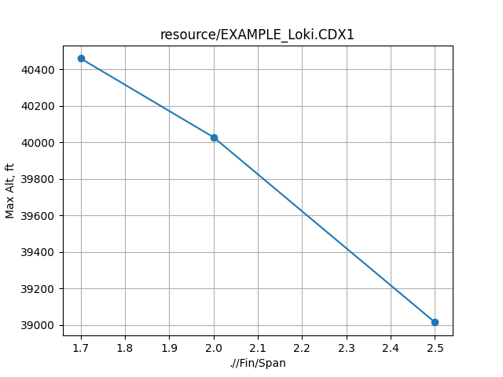

# rasaero_optimizer
PyAutoGUI-interface with RASAeroII. Allows for sweeps, optimization, etc. underneath its aero methodology.

RASAero II can be found [here](https://www.rasaero.com/).

# Disclaimers

_This is somewhat more of a really cursed meme than a real tool. But it does kinda work..._

Please feel free to reach out to me if you have any issues! (GH Issues tab, or, my email is on my profile)

- This has only been tested with the following, and even then, can be quite finicky to get working smoothly:
  - Windows 10
  - RASAEROII v1.0.2.0
 

> [!CAUTION]
> **YOU NEED TO MAKE SURE YOUR WINDOWS-WINDOW-SCALING IS SET TO 100% OR ELSE THIS WILL CERTAINLY NOT WORK**
>
> Right click desktop -> Display Settings -> Scale and Layout -> "Change size of text, apps, and other items" -> 100%

# TODOs/Limitations
- ~~implement "rules" that you apply to inputs to help constrain things (like making sure fin is at same distance from aft end)~~
- ~~refactor examples into their own folder~~
- Implement exporting of all data - currently only can extract Max Altitude
- add option to save CDX1 files, or make this an actual temp file
- Make interacting the CDX1 file more pythonic- convert it to a nested dict or something so you don't have to key with kinda gross xml...?
- ~~Gradient descent ( i wish i was kidding )~~
- allow enforcement of "rules" during optimization
- parallelization with numerous RAS windows (i am mostly kidding this time)

# Common Issues
There are a lot of things that can causes issues in this auto-gui paradigm. Gonna try and keep a list of my common findings here.

> Exception has occurred: ImageNotFoundException
> Could not locate the image

  1) the window/screen hasn't updated in time to show the info PyAutoGUI is looking for. ***Try increasing the delay parameters first***
  3) the image on your screen is **actually** different (to the computer-eye) than the reference image. ***You can take screenshots of the buttons as seen on your device with the snipping tool, and save over the reference images (try and make yours match as closely as possible in framing, though) in resources/***

Sometimes it doesn't find the Marginal Stability warning screen, regardless of delay timing... don't know why this one happens.

# Getting Started

Clone this repo, setup your python environment as you wish, run the following (from the base directory) to install dependencies:
>pip install -r requirements.txt

Open RASAeroII -> "Select Motor File" -> point it to the [test-case .eng file](ras_optimizer/resource/Loki_L2050LW.eng)

**With a clean RASAeroII window open, run the following from the base repo directory:**

> python -m ras_optimizer

**then quickly alt-tab to bring RASAeroII back on the screen if it isn't visible already.**

**With luck, it should start chugging away, running a sweep of Fin spans.**

When complete, it should plot something like this (_if you have python setup to display plots_):

> [!Note]
> Your results may not be exactly the same, as I may have updated things, or you may have different settings selected in RASAero.

# Other examples
These are unfortunately beholden to annoying python functional paradigms (or i am just stupid), so including directions on how to run.

## [multi_var_sweep.py](ras_optimizer/examples/multi_var_sweep.py)
This does a multi-variate sweep across many design parameters. Can run "zip" or "product" style inputs

run the following from the main repo directory
> python -m ras_optimizer.examples.multi_var_sweep

## [multi_var_sweep.py](ras_optimizer/examples/multi_var_sweep.py)
This does a multi-variate sweep across many design parameters. Can run "zip" or "product" style inputs

run the following from the main repo directory
> python -m ras_optimizer.examples.multi_var_sweep

# Usage

A helper high-level function, cdx1_sweep() is a helper that deals with setting up and iteration over cases. You hand it:
- a CDX1 input file
- a temporary filename to write modified CDX1 files to
- a "sweep-dictionary" which defines which variables you are iterating over
- optionally, rules that are a function of the sweep-dictionary values (see examples)

This can handle zip() or product() style inputs.

> [!Note]
> Alternatively, if you want to write your own outer loops, you can interact with the main RAS driver, open_and_run_RAS() directly

The way you find the key for variables to "override"/sweep-over is by looking at the .CDX1 file. This allows you to key into any of the variables in it: fin parameters, body, nosecone, etc. It looks a bit crude, but is relatively straightforward.

