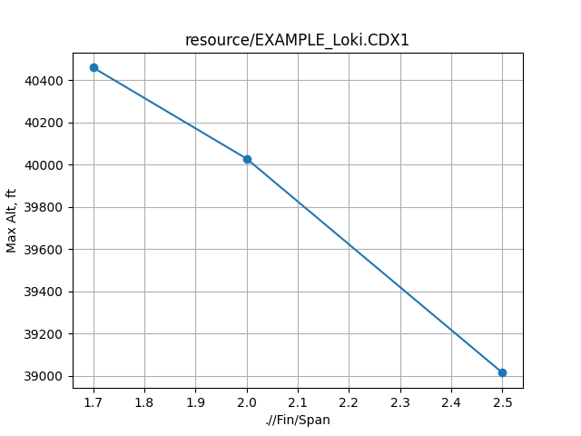

# rasaero_optimizer
PyAutoGUI-interface with RASAeroII. Allows for sweeps, optimization, etc. underneath its aero methodology.

RASAero II can be found [here](https://www.rasaero.com/).

# Disclaimers
- This has only been tested with the following, and even then, can be quite finicky to get working smoothly:
  - Windows 10
  - RASAEROII v1.0.2.0
 
Please feel free to reach out to me if you have any issues! (Issues, or, my email is on my profile)

> [!CAUTION]
> **YOU NEED TO MAKE SURE YOUR WINDOWS-WINDOW-SCALING IS SET TO 100% OR ELSE THIS WILL CERTAINLY NOT WORK**
>
> Right click desktop -> Display Settings -> Scale and Layout -> "Change size of text, apps, and other items" -> 100%

# TODOs/Limitations
- Implement exporting of all data - currently only can extract Max Altitude
- Make interacting the CDX1 file more pythonic- convert it to a nested dict or something so you don't have to key with kinda gross xml.

# Debugging
There are a lot of things that can causes issues in this auto-gui paradigm. Gonna try and keep a list of my common findings here.

> Exception has occurred: ImageNotFoundException
> Could not locate the image

  1) the window/screen hasn't updated in time to show the info PyAutoGUI is looking for. ***Try increasing the delay parameters***
  3) the image on your screen is **actually** different (to the computer-eye) than the reference image. ***You can take screenshots of the buttons as seen on your device with the snipping tool, and save over the reference images (try and make yours match as closely as possible in framing, though) in resources/***

# Getting Started

Clone this repo, setup your python environment as you wish, run the following (from the base directory) to install dependencies:
>pip install -r requirements.txt

Open RASAeroII -> "Select Motor File" -> point it to the [test-case .eng file](resource/Loki_L2050LW.eng)

**With a clean RASAeroII window up, run ras_optimizer.py, then quickly alt-tab to bring RASAeroII back on the screen if it isn't visible already.**

**With luck, it should start chugging away, running a sweep of Fin spans.**

When complete, it should plot something like this (_if you have python setup to display plots_):

> [!Note]
> Your results may not be exactly the same, based on other settings you have selected in RASAeroII.

# Usage

